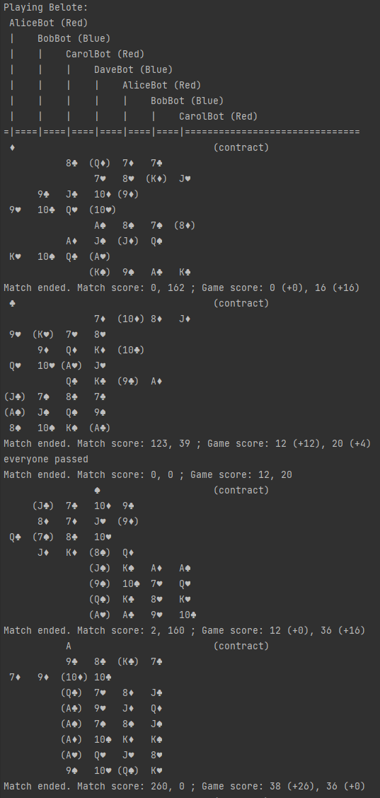
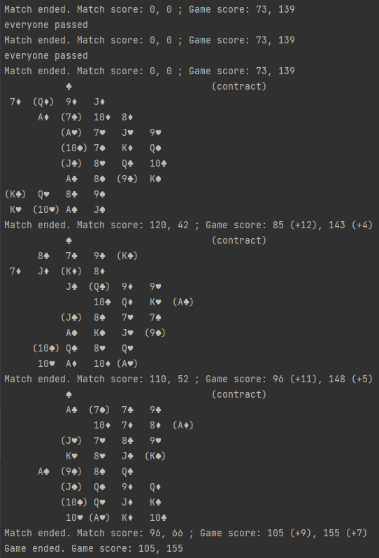

# game-belote
An implementation of the game Belote in C#

Includes some very simple AI implementations with the goal of simulating games.

More specifically, the goal is to examine the effects of different cutting/shuffling strategies of players on the overall game.
Does one way of cutting make it more likely that good cards come your way?

This is not an attempt at implementing "card counting".

## Example
An example output with all bot players:  
  
